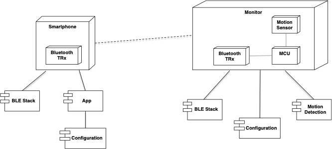
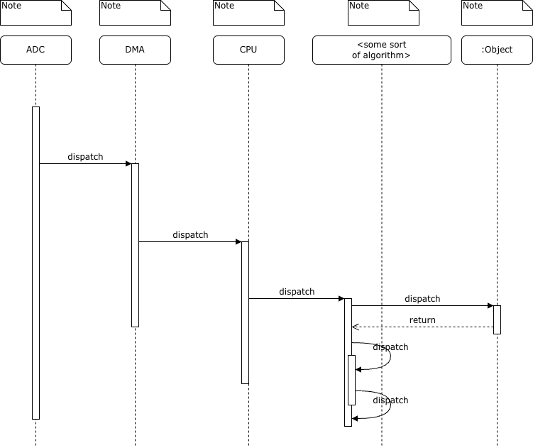

#ECE 315 – Design Assignment: Real-Time Data Acquisition 

<any text between angle brackets is informational and should be deleted in the final version of the report.>

## Introduction
<summarize the problem, objectives, and approach to this assignment>

## System Overview
<Write a brief overview of the system architecture and include a block diagram. An example is provide below. Make sure to identify and describe each node and component on the diagram. A table may be used for this>
A high-level deployment diagram for the envisioned system is shown in Figure 1.

Figure 1 An example system deployment diagram using UML2

As mentioned in the introduction, the main function of the system is to control motor rotation direction based on a single input control signal. The name and purpose of each of the nodes and components shown in Figure 1 are summarize in Table 1 below.

Table 1 Description of the main system nodes and components
<table>
  <thead>
    <tr>
      <th>Name</th>
      <th>HW or FW</th>
      <th>Description</th>
    </tr>
  </thead>
  <tbody>
    <tr>
      <td>Row 1, Cell 1</td>
      <td>Row 1, Cell 2</td>
      <td>Row 1, Cell 3</td>
    </tr>
    <tr>
      <td>Row 2, Cell 1</td>
      <td>Row 2, Cell 2</td>
      <td>Row 2, Cell 3</td>
    </tr>
    <tr>
      <td>Row 3, Cell 1</td>
      <td>Row 3, Cell 2</td>
      <td>Row 3, Cell 3</td>
    </tr>
  </tbody>
</table>

Each of the main design tasks related to the architecture are summarized in the following subsections.

## Design Tasks

### 1. ADC and Sampling Design
Recall design constraints for ADC and sampling:
1. Analogue input bandwidth: 0-2 kHz

**Part 1.1**  
With these constraints in mind, we first find the minimum sampling rate. Here, we apply Nyquist-Shannon Sampling Theorem, which states bandlimited frequencys with
$f_{max}$ can be reconstructed perfectly where: $$f_s \geq 2 f_{max}$$, and need anti-aliasing filters to ensure $$\frac{f_s}{2} \geq f_{max}$$. Apply rule-of-
thumb: sample **2-10x** $f_{max}$ for margin & filter roll-off.

* Thus, we find that $f_{max}$ is the max analogue input signal of 2 kHz
* A minimum rate (Nyquist) would be 4 kS/s (4 kHz), however we want to give ourselves some headroom and aliasing budget
* Multiply this value by 3, and we get the sampling rate of: $f_s = 6 kHz = 6 kS/s
* The new Nyquist Frequency is $$f_N \geq \frac{f_s}{2}$$, thus $$f_N = \frac{6 kS/s}{2} = 3 kS/s = 3 kHz
* Rate was choosen to help with design overhead (margin), reduce aliasing folding, use of anti-alias filter, keep system cost low

**Part 1.2**  
We are then told the ADC samples 4 analogue channels in roun-robin mode, need to determine an effective per-channel sampling rate. We note that for the RP2040,
the ADC is set for muliple inputs and can utilize round-robin sampling. From the documentaiton, the RP2040 has only one ADC FIFO, so the sample from each source
(channel) are placed into the FIFO in an interleaved fashion, which must later be de-interleaved.

* To find the sample rate per channel, we use $$f_{per \space channel} = \frac{f_s}{M}$$ where M is the number of channels.
* Four channels to sample: $$f_{per \space channel} = \frac{6 kS/s}{4} = 1.5 kS/s$$.
* This is below the input range of 0-2 kHz for sampling, thus, we need to re-evaluate our total sampling rate.
* Set each channel to have sampling rate of 8 kS/s, thus: $$f_s = f_{per \space channel} \cdot M = 8 kS/s \cdot 4 = 32 kS/s.
* The new total Nyquist Frequency is $$f_N = \frac{f_s}{2} = \frac{24 kS/s}{2} = 16 kS/s$$.
* We now exceed the Nyquist frequency, which helps minimize the aliasing.
* Note that if we had kept the original sample frequencies, the Nyquist frequency is severly lowered, and thus the signal fidelity would be decreased. Fidelity
  is affected by the resolution (bit depth), time (sampling rate, jitter), noise (thermal), etc. Thus, by increaseing the sample rate for the per channel, the
  fidelity increases, and minimizes distortion.

**Part 1.3**  
Anti-aliasing filters are almost always recommended for ADC sampling, pickup from stray signals (powerline frequency or even local radio stations!) may contain
such frequencies higher than the Nyquist Frequency, and thus these frequencies may alias into the appropriate frequency range.

* We use filters to anti-alias sampling for ADCs, in our design we wouldnt necessarily need one, but we will implement one for good practice
* Add a low-pass filter (passes low frequencies, but attenuates the high frequencies) before the sampler and ADC
* Based on our calculations, the transition band occurs at the max input frequency and the Nyquist (per channel) rate: $$f_{band} = f_{N \space Channel} - f_{max}
  = 4 kS/s - 2 kS/s = 2 kS/s$$ for the bandwith range of filtering
* Thus all the frequencies from 0-2 kHz will pass, 2-4 kHz are attenuated, and anything above the Nyquist frequency are rejected
* Thus, with oversampling, low-pass filter filtering we exceed requirements (could also implement digital decimation after filtering)

### 2. DMA-Based Data Acquisition
Recall design constraints for ADC:
1. ADC resolution: 12 bits
2. Note that the faster the ADC samples, the fewer the number of bit out. N-bit ADC can quantize the input signal to $$2^N$$ levels.
3. Even-to-response latency: 2 ms
We also note that the digital output range is approximately $$[-2^{N-1}, 2^{N-1} \space volts]$$.
4. The RP2040 DMA features are: 12 independent DMA channels, separate read/write bus masters, transfer 8/16/32-bit words with one read+write per cycle, supports
   paced (TREQ), and 100s MB/s throughput.

**Part 2.1**  
Reviewing the RP2040 data sheet, the ECE315 Lecture notes, we find that the ADC will continously be sampled, where the sample data is pushed to the ADC FIFO,
and then the DMA moves the data from the FIFO to a RAM buffer, and when a block is full the DMA signals to the CPU with an interrupt.

* The source for the DMA is the ADC FIFO register. From the datasheet the ADC_BASE is at *0x4004C00* with the ADC_FIFO at *0x4004C00C which is the source address
* When sending the data, the DMA will send this to a RAM buffer (array inside the RAM or the *block*), in this case we will use SRAM0 which will be the
* destination of the
  data at address *0x21000000*
* The transfer sizes that the RP2040 can handle are 8/16/32-bit transfers. The ADC samples at a resolution of 12-bits, thus we set the transfer sizes to 16-bits
  which allows for headroom. Thus we are utilizing *half-word* transfers
* For the block size, we consider the per-channel sample rate and allowed latency: $$T_{block} = \frac{N}{f_s}$$ which equates too: $$\frac{N}{8 kS/s} \leq 2 ms$$
  $$N \leq 16$$. Thus, we will set N (buffer size(s)) to be 16 samples
* The ADC is continously samping, and thus the DMA should transfer after the DMA channels are configured, ADC FIFO is enabled, and DMA controls registers are
 properly configured. For our design, we set the EN to 1 which allows the DMA to respond to triggering events, while also setting TREQ_SEL to handle pacing of
 the DMA with the CPU (Handled by DREQ_ADC = 36). Transfer will occur when the block is 'filled.' A transfer is signalled when BUSY (Bit 24) is 1 and
 TRANS_COUNT > 0.
* A transfer will be completed when the signal of the BUSY bit is set to 0, and TRANS_COUNT is set to 0. We can raised and IRQ (set IRQ_QUIET to 0) to let CPU
know that the sample block is ready.
  
**Part 2.2**  
DMAs are used to transfer large amounts of data without CPU involvement. The RP2040 specifically allows for transfers of Memory-to-Peripheral, Memory-to-Memory,
Peripheral-to-Peripheral. In this particular design, the CPU only needs to intialize the DMA once at the beginning, where the DMA then handles all the sampling 
data transfer from the FIFO to the SRAM. When the data is ready to be processed, an interrupt is sent to the CPU. This is preferable, as if the CPU had to 
constantly poll the ouput register of the ADC, if would need to store each sample in RAM itself, keep up with the sample rate, all while performaing various
othe CPU tasks. Thus the benefits of DMA are:

* Samples moved automatically
* Allow for lower latency
* Lower power consumption (allows CPU to *sleep*)
* Less data corruption
* CPU Overhead is reduced (time is freed for other logic)
* Increased CPU efficiency
* Faster Data transfers
* Improved system performance

**Part 2.3**  
As noted above, we have choosen our sample block size to be $$N = 16$$ samples. To further reduce overhead, and ensure we meet time constraints while constantly 
sampling, we will utilize a dual buffer design. Dual buffer, also known as *"PING PONG Buffers,"* which is a lot like a 2-element circular buffer. The process of
sampling then becomes: Processor receives DataReady interrupt from DMA, DMA sends a read to ADC for enough bytes to transfer one sample; where both these 
operations occur until 16 samples are filled, DMA transfer interrupt fires to CPU to signal algorithim to run.

The Double Buffer would require the use of SRAM1. In laymens terms, as the DMA fills one buffer (SRAM1), the CPU would process data in SRAM0, thus little to no
stopping occurs in processing. Setting *RING_SIZE* and *RING_SEL* in intialization of DMA from CPU helps achieve this.

Advantages are:
* True continous sampling
* CPU and DMA work in parallel
* Overrun and data loss is minimized (as sampling would stop for brief periods in a cycle)
* Keeps CPU load low in regards to data transfer

**Part 2.4**  

   
<Show a UML messaging diagram that illustrates the interaction between the ADC, DMA peripheral, and CPU>  
The interaction between the ADC, DMA peripheral, and CPU is illustrated in the messaging diagram of Figure 2.

  
Figure 2 An example messaging diagram

### 3. Interrupt and Processing Strategy
Recall some critical constraints for the design:
1. Maximum allowed event-to-reponse latency: 2ms
2. CPU must remain at 70% availability for unrelated application tasks

**Part 3.1**  
Table 1.1 Comparison of CPU polling, ADC/DMA block interrupt, ADC/DMA buffer interrupts
<table>
  <thead>
    <tr>
      <th>Strategy</th>
      <th>CPU Load</th>
      <th>Latency</th>
      <th>Complexity</th>
      <th>Real-time robustness</th>
    </tr>
  </thead>
  <tbody>
    <tr>
      <td>CPU polling of ADC results</td>
      <td>Direct polling from CPU to ADC would result in 100% load during sampling, constant block of other tasks, overhead completely consumed</td>
      <td>Would result in immediate processing, latency would be negligible, thus continous sampling but always blocking, processing window is minimal</td>
      <td>Simplest implementation, CPU directly polls, no DMA or interrupts to worry about. Timing is a smaller issue. Priority inversion occurs however.</td>
      <td>The robustness is poor, as this implementation is inherently problematic to priority inversion, CPU will get stuck polling for data, causing process/task starvation</td>
    </tr>
    <tr>
      <td>ADC/DMA with an interrupt at end of each block</td>
      <td>Lower CPU utilization, CPU is sleeping or doing other tasks until IRQ is fired from DMA. Would result in loss of data between reading of data and reconfiguration</td>
      <td>Sampling almost continous, though loss of data may occur when block is full. Latency would be up to $$\frac{N}{f_s}$$, more than polling</td>
      <td>Complexity is moderate, increases due to the use of a DMA. Requires use of interrupts for data processing and transferring. Use 1 DMA channel. Need to watch FIFO for overflow</td>
      <td>Robustness is better, usually a defacto standard. Allows for minimal missing of data (in this case for a motor, the odd sample missed is not critical). Works appropriately for an embedded system.</td>
    </tr>
    <tr>
      <td>ADC/DMA with half-buffer and full-buffer interrupts</td>
      <td>Lower CPU utilization, CPU would be able to do other tasks until IRQ is fired for half buffer (16-samples), while other buffer is filled by DMA.</td>
      <td>Would collect data much closer to direct polling, continous. Latency would result from $$\frac{N}{2f_s}$$ as this is a double buffer, would result in double the IRQ's compared to strategy 2</td>
      <td>Most complex solution, requires multiple interrupts due to use of 2 buffer solution. Uses 2 DMA channels. No FIFO overflow risk as DMA is always working.</td>
      <td>This solution has the best robustness for a Real-time system. It decouples the data sampling/colletion/transfer completely away from CPU. Utilizes DMA to fuller extent. Prevents task inversion and CPU starvation</td>
    </tr>
  </tbody>
</table>

**Part 3.2**  
For this system, as previously mentioned would be the ADC/DMA with half-buffer and full-buffer interrupts. This is essentially saying the 1 block (16 samples) is
one half-buffer, while an additional makes a full buffer (total of 32 samples). The processing of the first interrupt happens at $$T_{block} = \frac{16 \space samples}{8 kS/s} = 2 ms$$ which aligns with the specified design constraint, while also giving continous sampling.  
The DMA moves data from the ADC to SRAM without needing the CPU, only interrupting when data is ready to be processed, resulting in parallel operations between 
the devices. Results in CPU load remaining low (much lower than direct polling). This comes with an added cost to the complexity of the implementation (along with
using slightly more hardware), as the designer now needs to keep track of the varios interrupts from the DMA, track of the state machine and buffer states, ensure
proper data processing. Finally, this solution emobdies the embedded system design in which it is continously sampling (as the DMA does not need to stop with two
buffers), CPU and DMA work in parallel, no risk of stopping data acquistion while a block is processing by the CPU; results in the most accurate & logical decisions based on input from ADC.  

**Part 3.3**
It is imperative to keep ISRs short, that is, an ISR should take little time & execution time should have a *known worst case upper bound* keeping it 
deterministic. ISRs should be doing time-critical or handling external events. They need to be short to handle these external asynchronous events, tight timing
requirements need to be met, high-frequency events (such as the DMA sending fairly consistent sampling updates).
In summary:
* ISR's can not delay other interrupts
* Could increase timing (causing missed data, jitter, etc.)
* Reduce responsiveness of system
* Soft/Hardlock system
* Make embedded system much more undetermnistic

The work done inside an ISR for our design should be:
* To handle the DMA interrupts of block ready
* Determine if the first block or second block is ready
* Set various flags pertaining to motor operation

ISRs should avoid doing:
* Memory heavy tasks
* Complex arithmetic operations
* Transfferring data from ADC/DMA/SRAM
* Reading/processing/manipulating sampling data
* Updating the motor machine state
These above tasks should remain in the main program or FreeRTOS enviroment, rather than being executed by an ISR to keep them short and predictable.

Of course digital signal processing (DSP) should be done (which occurs in the main part of the program and *NOT* an interrupt). DSP is much easier to fix and
correct than analogue signal. DSP are usually 0 "off" or 1 "on," determined by a threshold of some measure; in this design case, it would be based on a voltage.
If too much noise is added to a signal, exceeding our threshold, we will be unable to get a signal with perfect/good fidelity. As the signal is a measurement that
is voltage which is proportional to the postion error; the RP2040 must respond appropriately, otherwise,
Faults that could occur with no DPS:  
* Undefined behaviour between toggling clockwise or counterclockwise rotation of motor
* False triggers/flags set by the various peripherals
* Violation of response time constraints

One solution to some processing could be *Adaptive thresholding,* a process used to adjust the threshold level dynamically to the current signal level in order
to seperate the signal from the background noise. Another could be *Dual Hysteresis thresholding* where two thresholds are used, similar to a chip select (a low 
and high). We want to ensure that this processing has a *very* minimized affect on the latency of the system, to keep within the 2ms reponse limit.
Small processing would result in:  
* Motor jitter/chatter being significantly reduced
* Motor stability increased
* Smoother operation
* Extended life of components due to reduction of switching in components

### 4. Motor Control  
For this design, we choose the A4988. This is because:
* Max current phase of 2A
* Large Voltage operation range from 8-35V
* Minimum Logic Voltage of 3.3V
* Can perform micro-step resolutions (down to 1/16)
* Requires only two pins for logic (STEP, DIR)
* Current limiting
* Coils controlled automatically by driver

**Part 4.1** 
The two pins required for control signals on the driver are:
* STEP - A pulse on this pin would advance the motor by one step (depending on configured step size)
* DIR - Would most likely be a signal set low or set high to enable direction of roration for the step(s)
Optionally, one can also use:
* ENABLE - Which when pulled high or low would determine driver outputs
* MS1/2/3 - Sets the microstepping level for the driver
* RESET/SLEEP - Usually active low and pulled high internally

The two logic pins would be connected to GPIO pins on the RP2040, Enable also to a GPIO pin. The MS1/2 would be 'jumped' high, while MS3 would have no jumper 
inserted to remain low; also to be set through GPIO on the RP2040 -- this would result in 1/8 microstepping.  

RESET/SLEEP are usually jumped together.  

**Part 4.2**
For this current design, we will opt with GPIO bit control (mostly because this is what I saw in lecture!) which also utilizes memory-mapped peripheral access 
(the GPIO pins being set on the API).  
We would first set the required GPIO pins on the RP2040 (5 total here for DIR, STEP, MS1/2/3), to be all digital outputs, and thus we would then set all pins to 
*OUT*. Logic would be intialized to zero. We would utilize masking for MS1, MS2, and MS3 through definitions, and concurrently create two structs, one for 
microstepping (sets the masks for type of step from 1/16 to full step), and another for the direction. First, the microsteps to be driven would be set through
the struct masking, and calculating the appropriate delay between the stepping pulses, creating the microstepping configuration signals. Next, the direction 
signal is generated, where depending on the threshold level and the command sent, would determine the direction of the steps, set before the *'pulses'* are sent
from the microstep bitmasking function. Finally, a step delay would need to be created based on the desired RPM, and account for the duration of stepping pulse 
to create the perceived rotation (essentially, this controls the speed). This cumlulates into the STEP signal which is driven high based on the direction and 
delay functions that lie within, turning the pin 'on' and 'off' to simulate a psuedo PWM.  

**Part 4.3**
We will utilize the formula:  
$$Pulse \space Frequency \space = steps \space per \space revolution \space \times \space revolutions \space per \space second

### 5. Feasibility and CPU Budget Analysis

### 6. System-Level Design Tradeoffs

## AI Usage Declaration

<Please indicate if you used an AI to help with this assignment and if so, what insights you gained; for example how it helped you understand this assignment>

## Resources

ECE315 Lecture Notes   
[1] https://www.ti.com/lit/an/slyt626/slyt626.pdf?ts=1775333427164&ref_url=https%253A%252F%252Fwww.google.com%252F   
[2] https://www.ni.com/en/shop/data-acquisition/measurement-fundamentals/analog-fundamentals/anti-aliasing-filters-and-their-usage-explained.html   
[3] https://www.youtube.com/watch?v=Sv_wMr9_Mwk
[4] https://forums.ni.com/t5/Multifunction-DAQ/what-do-you-mean-by-MS-s-or-KS-s-as-unit-of-frequency-I-m-used/td-p/925278   
[5] https://forums.ni.com/t5/Multifunction-DAQ/What-is-the-unit-kS-s-stand-for/m-p/4258344#M10295   
[6] https://pip-assets.raspberrypi.com/categories/814-rp2040/documents/RP-008371-DS-1-rp2040-datasheet.pdf?disposition=inline   
[7] https://forums.raspberrypi.com/viewtopic.php?p=1861895#p1861895   
[8] https://embedded.fm/blog/2017/3/21/ping-pong-buffers   
[9] https://electronics.stackexchange.com/questions/469121/why-should-interrupts-be-short-in-a-well-configured-system   
[10] https://medium.com/trading-data-analysis/start-setting-thresholds-like-a-pro-c58e611fb0cb  
[11] https://www.handsontec.com/dataspecs/module/A4988.pdf  
[12]  https://www.handsontec.com/dataspecs/L298N%20Motor%20Driver.pdf  
[13] https://www.reddit.com/r/arduino/comments/jn6zeg/how_to_chose_the_right_motor_driver/   
[14] https://forum.pololu.com/t/which-to-use-l298n-h-bridge-or-the-a4988-stepper-motor-driver-carrier/9868  

